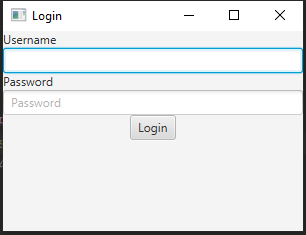
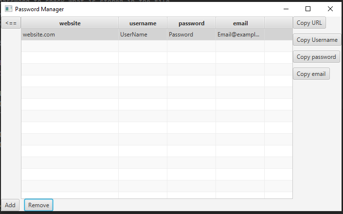
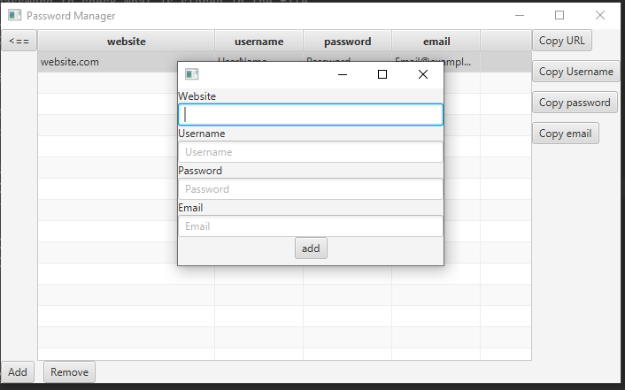
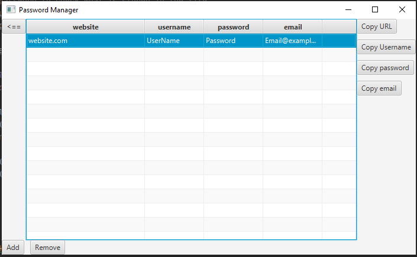

# Java Practice-Password-Manager

# Checks if the username and password are correct

# Where URL,UserName, Password, and Emanil are stored
# Select a row and click the copy username button to save it to the clipboard

# Adds a field to the table and file

# Removes from the table with Remove button

